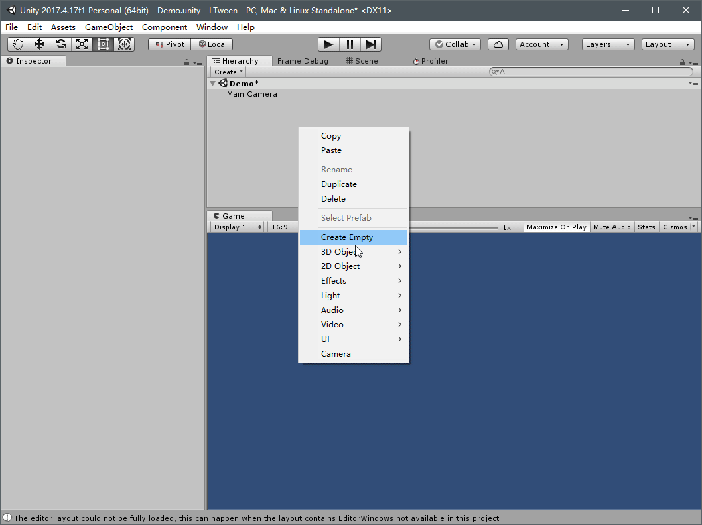

# LTweener

## Summary

Just another tweener for Unity.
Developed under Unity 2017.4.

## High-Level Usage

Add a `TweenerTrack` in your script, then invoke it as you see fit.
Any `Vector`, `Color`, `Float`, `Int` or `enum`(with a bit of wrapping) properties from
the attached GameObject (or its descendants) can be tweened with the track, as the gif example shows.

## License

This project is distributed under the terms of both the MIT license and the Apache License (Version 2.0).

See LICENSE-APACHE, LICENSE-MIT for details.
